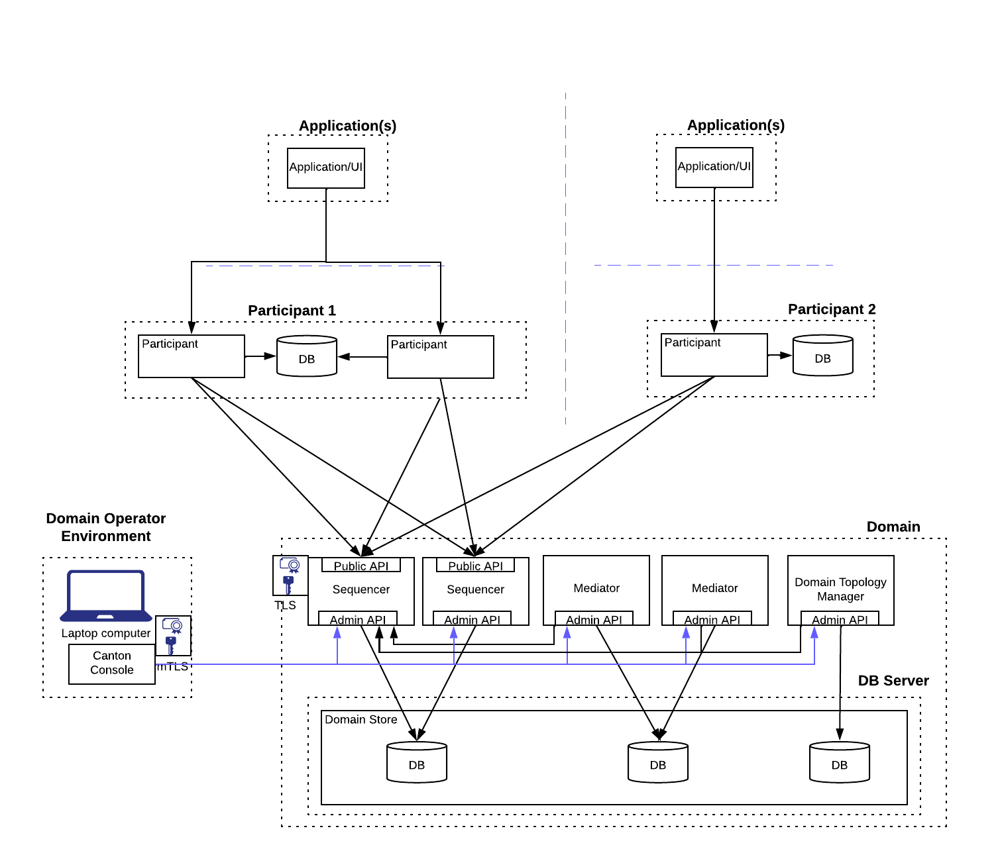
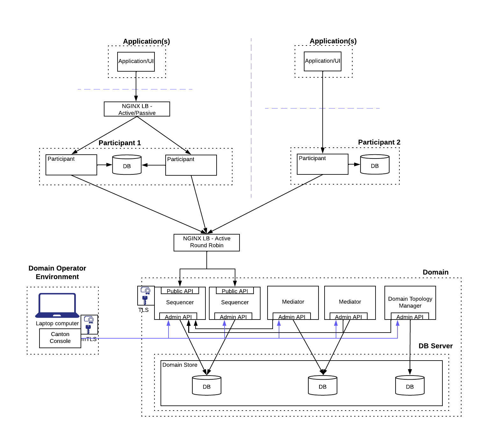

# Test Secure HA Configuration

Test Scenario:
- Domain Sequencer in HA mode
- Domain Mediator in HA mode
- Participant connects to Sequencer using Client-Side HA (participant configured to know of both Seqs rather than load-balancer)
- Participant in HA Mode

These steps are pulled from:
- [Canton HA Overview](https://docs.daml.com/canton/architecture/ha/overview.html)
- [Canton Documentation on High Availability](https://docs.daml.com/canton/usermanual/ha.html)
- the whitepaper "Daml 2.0 HA Configuration Overview" (contact DA for copy of whitepaper)

## Multi-Node HA Domain - Client Side Load Balancing (Enterprise)



### Items of Note include:
- Ledger API clients also need to understand the multiple destinations and perform client-side
  failover. NOTE: Ledger API commands to passive participant are rejected.
- Sequencer is active/active. Participant and Mediator nodes operate in active/passive mode with state managed through shared database


```angular2html
# IMPORTANT: Make sure to edit env.sh and set ENABLE_HA to "CLIENTSIDE"

# WARNING: This step clears any Postgres backing stores and deletes PKI
./cleanup-all.sh

# Build the Daml dars for the example (Canton Example Iou and Paint)
./build.sh

# Make the PKI CA (2 tier - Root and Intermediate) for Domain, Participants 1 & 2
./make-certs.sh

# Make relevant JWT Signing keys under each Participant CA and JWKS, along with 
# JWT tokens
# Script can be re-run to refresh the JWT tokens (one day expiry)
./make-jwt.sh
```

```
# Make sure env.sh has correct settings for HA

./start-postgres-domain.sh
# In separate Terminal window
./start-sequencer.sh
# In separate Terminal window
./start-sequencer2.sh
# In separate Terminal window
./start-mediator.sh
# In separate Terminal window
./start-domain-manager.sh
# In separate Terminal window
./start-remote-domain-ha.sh
```

#### Domain startup
Once the domain has come up you need to run the following command to initialize the domain.
```
# On Remote Admin Management console
# Start up domain by running
domain.setup.bootstrap_domain(Seq(sequencer1), Seq(mediator))
```

### Enabling HA for Domain

```angular2html
# On Remote Admin Console
import com.digitalasset.canton.sequencing.GrpcSequencerConnection
val conn2 = GrpcSequencerConnection.tryCreate("https://localhost:4421")
mediator.sequencer_connection.modify(_.addConnection(conn2))

# To see list of connections
mediator.sequencer_connection.get()

# On Domain Manager Console
import com.digitalasset.canton.sequencing.GrpcSequencerConnection
val conn2 = GrpcSequencerConnection.tryCreate("https://localhost:4421")
domain.sequencer_connection.modify(_.addConnection(conn2))

domain.sequencer_connection.get()

# In separate Terminal window
# This starts the second mediator and after a period they will decide who is primary 
./start-mediator2.sh
```

Participants are using Client Side load-balancing in this example.

Start participants. The bootstrap script will register with one sequencer by default. 
Second is added as a subsequent step.

```angular2html
./start-postgres-participant1.sh
./start-participant1.sh

./start-postgres-participant2.sh
./start-participant2.sh

# The following steps add the second sequencer to each participant configuration 

# On P1
participant1.domains.modify("domain", _.addConnection("https://localhost:4421"))

# On P2
participant2.domains.modify("domain", _.addConnection("https://localhost:4421"))
```

### Enabling HA for Participant 1

We start the second instance of Participant 1. As the two copies of Participant 1 share a common database
they are able to agree who is primary and the secondary goes into a passive mode.

```angular2html
./start-participant1b.sh
```

## Multi-Node HA Domain - Proxy Load Balancing (Enterprise)

In this example we use the Open-source version of NGINX to proxy GRPC to sequencer and 
the participant. Note that this cannot take advantage of dynatic health checks from the 
nodes as this is an NGINX Pro feature.



IMPORTANT NOTE: This configuration has not been tested for full scalability and availability. 

### Items of note include:
- Sequencer Proxy does not enforce mTLS as this is not a feature of Sequencer Public API - no need for client certificate based authentication
- Participant Proxy enforces mTLS but uses a separate certificate for connection to the backend
  participant nodes.
- Sequencer and Participant work in active/passive mode so proxy is configured as primary / backup
- Health Checks are a feature of NGINX Pro and should be used in production


```angular2html
# IMPORTANT: Make sure to edit env.sh and set ENABLE_HA to "LOADBALANCER"

# WARNING: This step clears any Postgres backing stores and deletes PKI
./cleanup-all.sh

# Build the Daml dars for the example (Canton Example Iou and Paint)
./build.sh

# Make the PKI CA (2 tier - Root and Intermediate) for Domain, Participants 1 & 2
./make-certs.sh

# Make relevant JWT Signing keys under each Participant CA and JWKS, along with 
# JWT tokens
# Script can be re-run to refresh the JWT tokens (one day expiry)
./make-jwt.sh
```

```
# Make sure env.sh has correct settings for HA

./start-postgres-domain.sh
# In separate Terminal window
./start-lb-sequencer.sh
# In separate Terminal window
./start-sequencer.sh
# In separate Terminal window
./start-sequencer2.sh
# In separate Terminal window
./start-mediator.sh
# In separate Terminal window
./start-domain-manager.sh
# In separate Terminal window
./start-remote-domain-ha.sh
```

#### Domain startup
Once the domain has come up you need to run the following command to initialize the domain.
```
# On Remote Admin Management console
# Start up domain by running
domain.setup.bootstrap_domain(sequencers.remote, Seq(mediator))
```

```angular2html

# In separate Terminal window
# This starts the second mediator and after a period they will decide who is primary 
./start-mediator2.sh
```

Participants are using a NGINX Proxy load-balancer in this example.

Start participants. The bootstrap script will register with the sequencer through the NGINX proxy.

NOTE: We only add load balancer for Participant 1. Participant 2 is left as an exercise for the reader.

```angular2html
./start-lb-participant1.sh
# In separate Terminal window
./start-postgres-participant1.sh
# In separate Terminal window
./start-participant1.sh
# In separate Terminal window
./start-participant1b.sh

# In separate Terminal window
./start-postgres-participant2.sh
# In separate Terminal window
./start-participant2.sh
```
## References

### NGINX
- http://nginx.org/en/docs/http/ngx_http_grpc_module.html
- http://nginx.org/en/docs/http/ngx_http_upstream_module.html
- http://nginx.org/en/docs/http/configuring_https_servers.html


**Copyright (c) 2024 Digital Asset (Switzerland) GmbH and/or its affiliates. All rights reserved.
SPDX-License-Identifier: Apache-2.0**
