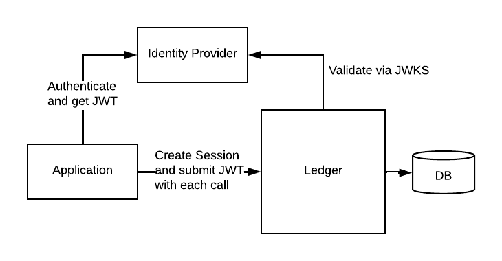

## Core Concepts

_This section assumes some level of understanding of Daml language and concepts. Please walk through the [Getting Started](https://docs.daml.com/getting-started/index.html) section
prior to reading this._

The Daml language and the associated Daml runtime use a variety of concepts relating to Identity Management, Authentication and 
Authorization.

### Parties

At the highest level of abstraction, Daml language and runtime deal with ```Parties``` that interact 
with a Daml model. Parties are used within a Daml model to define who has access to see data, who can perform
actions against the data/contracts, etc.

Daml enforces privacy of data by allowing the developer as they create their Daml model, to define which
data elements and actions ("choices") are allowed and the data access controls.

If we review the **Iou** contract:

```angular2html
template Iou
  with
    payer: Party
    owner: Party
    amount: Amount
    viewers: [Party]
  where

    ensure (amount.value >= 0.0)

    signatory payer
    observer owner
    observer viewers
```

we see that the developer created a data structure that tracks some data elements (payer, owner, amount and viewers) and
defines that the payer is a "signatory" (entity that allows the creation or deletion of the contract) and the owner and viewers 
are "observers" (allowed to see contract and contract data). 

### Allocating Parties - How does the Daml runtime know what parties exist? 

As part of setting up and operating a Daml ledger (whether for development, testing or production), it is necessary to define parties to the 
system. A simple way to achieve this is through [Daml Script](https://docs.daml.com/daml-script/index.html) which provides functions to allocate a party onto a ledger. 
For example, in the default Daml template the following function is used:

```angular2html
getOrCreateUser : Text -> Script User
getOrCreateUser alias = do
  userId <- validateUserId $ toUserId alias
  try
    getUser userId
  catch
    UserNotFound _ -> do
      p <- allocateParty alias
      let u = User userId (Some p)
      createUser u $ [CanActAs p]
      pure u
```
This performs the following:
- validates the user string conforms to correct format (toUserId just lowercases the provided string)
- tests whether the user exists
- if the user does not exist then
  - allocate a party with the provided alias
  - fills out a User data structure with user name and party name
  - creates the user on the ledger and defines a right to allow the user to ActAs the newly defined party
  - return a handle the user

**By convention, many of the Daml example applications make the party alias the lowercase version of the User name. This is not
mandated and applications should make no assumptions about the linkage of string for Users and Parties.**

We now have a User (more on this in a moment) defined that is linked to a party on the ledger. The latter is passed
to the runtime whenever an application attempts to perform Daml actions (create contracts, exercise choices)
and the Daml runtime validates that the party is appropriate authorised to access the contracts or perform actions against 
them based on the model.

### Users - What is the difference with Party?

Users are a concept introduced in Daml 2.0 and allow better decoupling of the Identity Management system used 
for a specific Participant from the Ledger itself.



As a general pattern, a Daml application, operating over the Ledger API, needs to authenticate itself to a Ledger so that it can pass Daml commands
to the ledger to create, archive contracts and perform choices on these contracts. An application uses credentials to 
authenticate against an Identity provider, which returns a JWT token (more on this below) that the application passes 
with every request. The Ledger will validate the token by confirming that it is a validly issued
token. The token could define every party that the application can operate as. However, this would bind the Identity 
Management tightly to the Ledger and would need to manage and synchronise a lists of parties that the application can 
act or read as.

```User``` allows a participant node to abstract the management of parties and rights away from the Identity Provider. An 
application authenticates and is provided a token a specific ```User``` and the Participant node manages the mapping from the User to 
Parties and Rights (ParticipantAdmin, CanActAs, CanReadAs).

### JWT Tokens

A lot of the low-level detail on JWT was covered in our previous version of the Ref App for Daml 1.X. This can be found here:

[Github: digital-asset/ex-secure-daml-infra](https://github.com/DACH-NY/ex-secure-daml-infra/blob/master/Documentation/CoreConcepts.md#authentication-tokens-jwts-jwks)

Daml API supports several JWT Token formats to handle Users and Parties. Any application or tool (including Daml SDK tools like Script, Triggers, Navigator, etc)
needs to supply a token to be properly authenticated. 

### User Access Tokens:

This format offers the simplest amount of data that an IDM is expected to return. On
a valid authentication the JWT contains the participant Id, the user Id, an expiry datetime
and a scope (Must be "daml_ledger_api" or one of a set of scopes). The mapping of users to
the rights and parties that the User can operate as is defined in the participant node.

NOTE: A default user of ```"participant_admin"``` is configured on a ledger and an IDM can be configured to return a token
to appropriately authenticated users with Participation Administration rights. This user has no rights to transact as any
party on the ledger.

Described in detail here: [User Access Token](https://docs.daml.com/app-dev/authorization.html#user-access-tokens)

```
{
"aud": "someParticipantId",
"sub": "someUserId",
"exp": 1300819380
"scope": "daml_ledger_api"
}
```

### Custom Claim Token

This format allows more control and customization of the claims being made by an application. The primary difference is
that the claims include the ability to directly state that the application has participant administration rights
and what Parties the application CanActAs and CanReadAs.

Note: Since the custom claim has to use the party Id, the creates a tight binding between the ledger and identity management
system, where an (out of band) process needs to keep the participant's party list and the IDM's user list coordinated.

Described in detail here: [Custom Claim Token](https://docs.daml.com/app-dev/authorization.html#custom-daml-claims-access-tokens)

```angular2html
{
   "https://daml.com/ledger-api": {
     "ledgerId": null,
     "participantId": "participant1::123e4567-e89b-12d3-a456-426614174000",
     "applicationId": null,
     "admin": true,
     "actAs": ["party-01234567::123e4567-e89b-12d3-a456-426614174000"],
     "readAs": ["party-0987654321::123e4567-e89b-12d3-a456-426614174000"]
   },
   "exp": 1300819380
}
```

## Domains, Participants, Namespaces

So far we have looked at Parties - the concept that a Daml model uses to track who can read and act on data, and Users - a way to 
allow applications to authentication and decouple a Ledger from the Identity Provider. How do these then work in a real
ledger, across organizations to enable a production application?

As described in [Daml Ledger Model](https://docs.daml.com/concepts/ledger-model/index.html), parties operate against a shared 
virtual ledger. In the case of Daml, a virtual ledger consists of one or more "Domains" and one or more "Participant" nodes. 
The Participant node executes the requested transactions on behalf of parties hosted on that Participant and the Domain sequences, 
and distributes the relevant (sub-)transactions amongst the Participant nodes involved in that transaction and ensures that all Participants 
agree that the transaction is valid. There is significantly more detail involved in this process and the [Daml Documentation](https://docs.daml.com/canton/architecture/overview.html#) 
provides detailed explanation of each node's role. We will not focus on this here. 

To ensure that the distributed system can differentiate uniquely the different connected nodes and hosted entities [(Domains](https://docs.daml.com/canton/architecture/domains/domains.html), Participants, Parties),
Daml uses the concept a "[Namespace](https://docs.daml.com/canton/usermanual/identity_management.html)". Each node creates a local namespace with an associated namespace root signing key. The 
fingerprint (hash) of this key forms the unique identifier for the node namespace (the long number after the :: in a 
participant identifier - e.g. "participant1::1220acf950b264479b0a74e9783f075e4d9658e6a446cd90d7c003a0fb6004706221"). Each Domain 
and Participant is associated with a different fingerprint of their respective signing keys. The management of the namespace and 
associated identifiers is the responsibility of the Namespace Topology Manager.  

When a Party is created on a Participant, the local Participant Topology Manager will allocate a unique Id for the party, consisting 
of the provided alias or a random number and the namespace fingerprint. 
This ensures that the new Party will be unique to the Participant and unique across all other connected nodes (Participants connected 
through common Domains).

Note: the choice of name format for Party currently depends on the tooling used to create the Party

- **Console:** Bank::12208cf66ee8b47feab1725d1d84ec7fa53333a396499f8ddb58d257bb260a5ae1aa
- **Script:** party-61fa17fa-b1f9-4d59-b4ad-4785070470ce::12208cf66ee8b47feab1725d1d84ec7fa53333a396499f8ddb58d257bb260a5ae1aa

(The Participant portion differs from the above as these came from participant2 namespace)

These are different parties but you should consider the consequences that more information is distributed to all other 
Participants in first form than second. 

A Participant node connected to a domain will share the local identities it manages with the domain (via "[Topology Transactions](https://docs.daml.com/canton/usermanual/identity_management.html#topology-transactions)")
and it is the responsibility of the Domain Topology Manager to distribute these to all other connected Participants. In this way
the set of Parties for all connected Participants nodes is distributed through the connected Domain Topology Manager. The Domain itself 
does not manage specific entities and signs the Topology transactions to ensure all Participants trust the entries are from authorised 
Participant nodes. As Participants and Parties are added and removed, additional Topology Transactions are used to distribute 
across connect Domains.

# User and Party Management

## Daml Documentation
This section supplements the details provided in the Daml Docs relating to:

### Daml Identities
- [Daml User Manual/Authorization](https://docs.daml.com/app-dev/authorization.html)

### Canton Ledger Identities
- [Architecture/Identity Management](https://docs.daml.com/canton/architecture/identity.html)
- [Core Concepts/Identity and Package Management](https://docs.daml.com/concepts/identity-and-package-management.html)
- [User Manual/Identity Management](https://docs.daml.com/canton/usermanual/identity_management.html)

### Canton User and Party Management Services
- [Party Management Service](https://docs.daml.com/concepts/identity-and-package-management.html)
- [User Management Service](https://docs.daml.com/concepts/identity-and-package-management.html)

### Canton Security and Cryptographic Keys
- [Security, inc Cryptographic Keys](https://docs.daml.com/canton/usermanual/security.html)


**Copyright (c) 2024 Digital Asset (Switzerland) GmbH and/or its affiliates. All rights reserved.
SPDX-License-Identifier: Apache-2.0**

