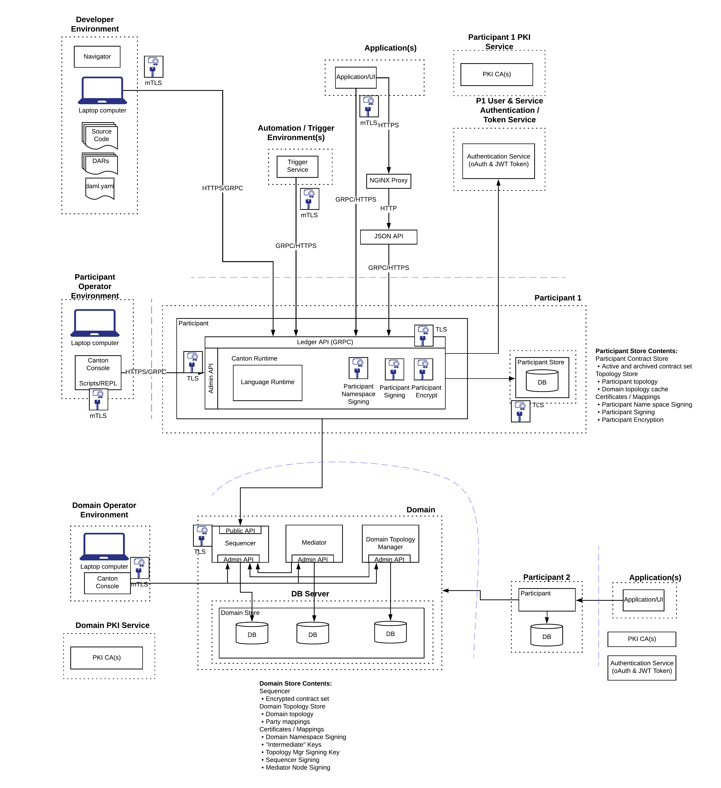

# Secure Canton Infrastructure Reference App

This reference app demonstrates:
- How to set up a Canton environment with full security (m/TLS, JWT). The components are shown in the diagram below.
- User and Party Management within a User enabled Ledger (Daml 2.0 or later)
- Operational Management of signing and encryption keys
- HA configuration of Sequencer, Mediator and Participant nodes

## Infrastructure Components

The specific features being tested include:
- segregated Canton Domain components (Sequencer, Mediator, Domain Manager) and standalone Participant 
nodes. 
- separate PKI setups for the domain and each participant node
- separate JWT signing keys
- Daml Scripts to execute each step of the sample workflow on each participant in the context of each 
party.

Note that we do not cover the intricacies of PKI and JWT as these remain similar to the version
provided in the Daml V1.x blogs and reference app (See References below). However we do call out the newer JWT 
formats for User Authentication. 

## Core Concepts

[Core Concepts (Users, Parties, Namespaces, Domains, Participants)](./Documentation/user-management.md)

## Setup and Testing Steps
- [Setup of Domain and Participants](Documentation/setup.md)
- [Local Canton Console Testing](Documentation/test-local.md)
- [Script and REPL Testing](Documentation/test-script.md)
- [HA Setup of Canton Domain and Participants](Documentation/test-ha.md)
- [JSON API and Triggers](Documentation/test-json-triggers.md)

- [Sharing Dars across Participants (alpha feature)](./Documentation/dar-sharing.md)

# References

This example builds on the secure deployment of Daml V1.X document

Blogs:

- [Secure Daml Infrastructure - Part 1 PKI and certificates](https://blog.digitalasset.com/developers/secure-daml-infrastructure-part-1-pki-and-certificates)
- [Secure Daml Infrastructure - Part 2 JWT, JWKS and Auth0](https://blog.digitalasset.com/developers/secure-daml-infrastructure-part-2-jwt-jwks-and-auth0)

Original Github Ref App:

[ex-secure-daml-infra Github Repo](https://github.com/digital-asset/ex-secure-daml-infra)

**Copyright (c) 2022 Digital Asset (Switzerland) GmbH and/or its affiliates. All rights reserved.
SPDX-License-Identifier: Apache-2.0**

